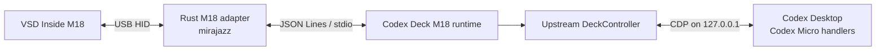

# Codex Deck M18

**English** | [日本語](README.md)

Codex Deck M18 is an open-source project that turns a VSD Inside M18 into a physical **Codex Micro control surface** for Codex Desktop on Windows or macOS.

Two deployment paths are available:

| Path | Status | OS | Dependency | Licensing boundary |
|---|---|---|---|---|
| [VSD Craft integration](#install-with-vsd-craft-recommended) | **Recommended** | Windows / macOS | Requires proprietary VSD Craft | This repository is open source, but the runtime path requires a closed-source vendor application |
| [Direct M18 connection](#install-with-a-direct-m18-connection-fully-open-source) | Maintained fully open-source path | Windows | No additional proprietary product | MPL-2.0 + GPL-3.0 + MIT components |

Both paths retain the Codex Micro connection, state synchronization, rendering, and event dispatch inherited from the upstream [Codex Deck](https://github.com/dazer1234/codex-stream-deck). In the recommended path, VSD Craft handles M18 USB communication, LCD transfer, and scene management. Linux is not supported.

> [!IMPORTANT]
> This is not an official product from OpenAI, the upstream Codex Deck project, or the M18 manufacturer. It uses private Codex Desktop interfaces and may require maintenance after Codex updates. The currently targeted compatibility versions are Codex Desktop 26.814.5167.0 and VSD Craft 3.10.188.226. The VSD Craft path has not completed a fresh live retest and must not be described as currently verified. See the [investigation record](docs/vsd-craft/原因調査.md) and [test results](docs/codex-micro-m18/テスト結果V1.md) (Japanese).

---

## What is Codex Deck?

Codex Deck is an upstream open-source project for controlling **native Codex Micro features** from physical devices. It is not a macro layer that merely translates buttons into keyboard shortcuts. It connects to Codex Desktop over local CDP and reads or dispatches the same events and state used by Codex Micro.

This M18 edition retains the following Codex Deck capabilities:

- **Six Agent keys:** use the source and assignments selected under `Codex Settings > Codex Micro`
- **Agent state display:** unassigned, idle, working, unread completion, approval/input required, and error
- **Selected-task synchronization:** keep the active Codex task and physical key in sync
- **Progress presentation:** Codex-aligned light/dark themes, state colors, and restrained animation
- **Micro actions:** on the public Stream Deck and VSD Craft paths, forward the configured `ACT06` through `ACT12` key-down/key-up events
- **Navigation:** map joystick directions to Plan, Forward, Sidebar, and Back
- **Reasoning controls:** encoder click and reasoning-effort adjustment
- **Official keycap commands:** resolve command definitions from the installed Codex application at runtime
- **Usage display:** 5-hour and weekly limits, combined overview, and reset credits
- **New task:** create a local task through `codex://threads/new`
- **Multiple hosts:** combine Windows and Mac through an authenticated SSH/Tailscale relay
- **Host health:** show degraded/offline status while retaining last-known state
- **iPhone companion:** access Agents, usage, and Micro controls from the SwiftUI app

### How Codex Deck maps to the three M18 scenes

The M18 uses three scenes of 15 LCD keys to provide all 45 required operations.

| Codex Deck capability | Core implementation | M18 scenes |
|---|---:|---:|
| Agent 1–6 and live state | Retained | Included |
| Joystick up/down/left/right | Retained | Included |
| Encoder click and reasoning adjustment | Retained | Included |
| 30 official keycaps | Retained | All 30 in VSD Craft; direct connection replaces the `MIC` position with `VOICE TALK` |
| Usage Limit / Usage Overview | Retained | Included |
| Rate Limit Reset | Retained | Included |
| New Task | Retained | Included as official `NEW` |
| Windows/Mac target switch | Retained | Included |
| Stream Deck plugin | Retained | Separate from the M18 path |
| iPhone companion | Retained | Separate from the M18 path |

## M18 features

- Run primary Codex Micro operations from the M18's 15 LCD keys
- Synchronize six Codex task states to the LCD
- On the direct-connection path, start live voice conversation from the M18-only `VOICE TALK` key
- On the VSD Craft path, retain the existing `MIC` / Push-to-talk control in that position
- Support Plan, Back, and Forward
- Do not modify M18 firmware, Codex Desktop, or USB drivers
- Require no OpenDeck hardware, Elgato Stream Deck hardware, virtual HID device, or keyboard-shortcut setup
- In the fully open-source path, include a resident watcher that reconnects after Codex or USB interruption, plus key-input diagnostic logs

## Supported hardware

| Item | Value |
|---|---|
| Product | VSD Inside M18 / HOTSPOTEKUSB HID DEMO |
| Vendor ID | `0x5548` |
| Product ID | `0x1000` |
| LCD keys | 15 |
| Bottom buttons | 3 |

VSD Craft owns USB communication when using the VSD Craft path. The USB IDs above are used by the fully open-source adapter to restrict its connection to the intended device.

## Key layout

The 45 required operations are placed without duplication across three scenes of 15 LCD keys.

| Scene | 15 LCD keys |
|---|---|
| Scene 1 | Agent 1–6, joystick up/down/left/right, reasoning encoder click, Windows/Mac target and health, Usage Limit, Usage Overview, Rate Limit Reset |
| Scene 2 (VSD Craft) | First official-key group: FAST, APPR, REJ, SPLIT, MIC (Push-to-talk), CODEX, BUG, OAI, TERM, DWN, DEL, NEW, NAV, MAGIC, DIFF |
| Scene 2 (direct connection) | FAST, APPR, REJ, SPLIT, VOICE TALK, CODEX, BUG, OAI, TERM, DWN, DEL, NEW, NAV, MAGIC, DIFF |
| Scene 3 | Second official-key group: PLAY, GIT, BRCH, MRG, PR, PAINT, LAB, PARTY, TIME, MIND+, MIND-, SETUP, FOLD, UPL, APPS |

### VOICE TALK for the direct-connection path only

On the direct-connection path, `VOICE TALK`, at the right edge of the top row in Scene 2, starts a live voice conversation in ChatGPT/Codex Desktop. It is dedicated to the M18. It is **not** Dictation, Push-to-talk, or a general public Codex Micro/Stream Deck action. The VSD Craft path does not make this substitution; the same position remains the existing `MIC` / Push-to-talk control.

A single press invokes Codex's native `composer.startVoiceMode` command directly, so no deck-side keyboard shortcut is required. This implementation only claims and documents **conversation start**; it does not claim that the same button stops an active conversation.

Press feedback is a four-frame, approximately 320 ms one-shot transition into the existing purple Codex Micro `active` state color and back to the static key. It never loops continuously. Repeated presses are canceled/rate-limited, and a failed frame write falls back to the static image. Every static and animated M18 frame is pre-rasterized as an opaque 64×64 PNG.

The official-key groups do not add a separate “dangerous key” classification. `APPR`, `REJ`, `DEL`, and `PLAY` are ordinary single-press controls. In the current implementation, `DEL` archives a chat. `PLAY` invokes the first configured Environment Action. `GIT`, `MRG`, and `PR` open their respective flows or review surfaces; pressing them alone does not finalize a commit, merge, or published pull request.

`Rate Limit Reset` is separate from those 30 controls and requires a 1.2-second hold because it can consume an available reset credit.

The bottom-left, bottom-center, and bottom-right physical buttons always switch directly to Scenes 1, 2, and 3. They are navigation controls and are not counted among the 45 LCD operations.

---

## Install with VSD Craft (recommended)

```text
Codex Desktop
    ↕ Codex Micro / CDP
Codex Deck plugin
    ↕ VSD official-SDK-compatible WebSocket
VSD Craft
    ↕ Vendor USB control
VSD Inside M18
```

### Requirements

- Windows 10 or later, or macOS
- Codex Desktop
- Node.js 20 or later
- VSD Craft for Windows or macOS
- A supported M18 connected over USB
- Windows source installation only: ESET command-line scanner, unless using `-SkipEsetScan`

Rust and a C++ toolchain are **not required** for this path. They are required only for the direct, fully open-source path.

VSDinside publishes its [Plugin SDK](https://github.com/VSDinside/VSDinside-Plugin-SDK) under MIT. The VSD Craft application itself is covered by the [vendor EULA](https://store.steampowered.com/eula/4269970_eula_0?l=english), which does not permit third-party redistribution. This repository therefore does not bundle VSD Craft. When needed, the installer obtains it directly from the [official download page](https://www.vsdinside.com/pages/download).

### Scene setup

Use the standard VSD Craft interface to place keys into three scenes:

- Bottom-left: Scene 1 — Agents, navigation, host, and usage
- Bottom-center: Scene 2 — first 15 official-key positions
- Bottom-right: Scene 3 — remaining 15 official-key positions

Assign only VSD Craft's standard scene-shift action to the three bottom physical buttons. Do not assign Codex operations to them.

### Windows

#### Release package (recommended)

Extract `codex-deck-vsd-craft-windows-v*.zip` from GitHub Releases and double-click **Install Codex Deck.cmd**. If VSD Craft is absent, the installer downloads the MSI directly from the official VSDinside server, verifies its Authenticode signature and publisher, and then opens the vendor installer.

The release ZIP backs up an existing plugin under `%LOCALAPPDATA%\CodexDeck\backups` before installing the bundled plugin. The package is not a signed installer; verify it against the release's `SHA256SUMS.txt`.

#### From source

Build the plugin before running the Windows installer:

```powershell
npm ci
npm run validate:vsd-craft
```

Then run:

```powershell
.\scripts\Install-VSDCraft-CodexDeck.ps1 `
  -VSDCraftInstallerPath 'C:\path\to\VSD-Craft-Installer_Windows.exe' `
  -Launch
```

Available switches:

| Switch | Purpose |
|---|---|
| `-VSDCraftInstallerPath` | Required path to the official VSD Craft installer |
| `-SkipEsetScan` | Skip the ESET pre-scan when ESET is unavailable |
| `-SkipVSDCraftInstall` | Update only the plugin when VSD Craft is already installed |
| `-Launch` | Start VSD Craft after installation |

The installer stops the fully open-source runtime to prevent USB ownership conflicts, moves its startup entry to `%LOCALAPPDATA%\CodexDeck\disabled-startup`, and backs up an existing plugin under `%LOCALAPPDATA%\CodexDeck\backups`.

### macOS

#### Release package (recommended)

Extract `codex-deck-vsd-craft-macos-v*.zip`, Control-click **Install Codex Deck.command**, and choose **Open**. If VSD Craft is absent, the installer downloads the PKG from the official VSDinside server, verifies the Apple package signature, and opens Installer. Run the Codex Deck installer again after the vendor installation completes.

The ZIP preserves executable permissions but is unsigned and not notarized. Verify it against the release's `SHA256SUMS.txt`.

#### From source

Install the official macOS edition of VSD Craft and Node.js 20 or later, then run:

```zsh
chmod +x scripts/install-vsd-craft-codex-deck-macos.sh
./scripts/install-vsd-craft-codex-deck-macos.sh
```

The plugin is installed to `~/Library/Application Support/HotSpot/StreamDock/plugins`; an existing version is backed up under `~/Library/Application Support/CodexDeck/backups`. See the [macOS VSD Craft guide](docs/vsd-craft/MACOS.md).

Build both OS release packages with:

```powershell
npm run package:vsd-craft-installers
```

Output is written to `outputs/vsd-craft-installers-v<version>`.

### Meeting panels (Windows only)

Optional `TEAMS`, `MEET`, `ZOOM`, and `Discord` scenes use a shared 5×3 layout. Create four empty scenes in VSD Craft, then run:

```powershell
npm run configure:meeting-panels
```

These panels depend on Windows shortcuts. See [Meeting Panels](docs/vsd-craft/MEETING_PANELS.md).

### Design records

[Needs](docs/vsd-craft/ニーズ.md) / [Change policy](docs/vsd-craft/修正方針.md) / [Execution policy](docs/vsd-craft/実行方針.md) / [Investigation](docs/vsd-craft/原因調査.md) / [Implementation report](docs/vsd-craft/対応報告.md) (Japanese)

---

## Install with a direct M18 connection (fully open source)

This maintained path requires no additional proprietary product. Do not run it at the same time as VSD Craft; both would compete for the same USB device.



The Node.js runtime uses the upstream `DeckController` and `CodexMicroRendererBridge`. The Rust adapter is limited to M18 input and LCD image transfer.

The adapter is GPL-3.0-only and the Node.js side is MIT. They are separate processes communicating only through JSON Lines over standard input/output, keeping their distribution and license boundaries explicit.

### Requirements

- Windows 10 or later
- Codex Desktop
- Node.js 20 or later
- Rust stable
- A C++ toolchain capable of building Rust for Windows
- A supported M18 connected over USB

### Build

```powershell
npm ci
npm run check
npm test
npm run build
npm run build:m18
```

Artifacts are generated under `dist\m18`.

### Connection check

The dry run probes only the M18 and Codex bridge; it does not modify firmware or settings.

```powershell
Set-Location .\dist\m18
.\Start-CodexDeck-M18.ps1 -DryRun
```

### Run

With Codex Desktop open and the M18 connected:

```powershell
Set-Location .\dist\m18
.\Start-CodexDeck-M18.ps1
```

If Codex Desktop is already running without the bridge, close it normally before starting the runtime. Use `-ForceRestart` only when an explicit Codex restart is intended.

```powershell
.\Start-CodexDeck-M18.ps1 -ForceRestart
```

### Resident watcher

Place `dist\m18` in a stable directory and register the watcher to run at Windows logon:

```powershell
powershell.exe -NoLogo -NoProfile -ExecutionPolicy Bypass -WindowStyle Hidden -File "C:\path\to\CodexDeck\M18\Watch-CodexDeck-M18.ps1"
```

The watcher restarts the runtime after it exits and follows Codex or M18 reconnections. Moving the directory after registration invalidates the startup path.

### Logs

| File | Contents |
|---|---|
| `m18.log`, created in the parent of the watcher directory | Watcher, Codex connection, M18 connection, render synchronization |
| `%LOCALAPPDATA%\CodexDeck\m18-events.log` | `key_down`, `key_up`, and physical key number |
| `%LOCALAPPDATA%\CodexDeck\codex-micro-bridge.json` | Current local CDP port state |

If input stops responding, first check whether new events appear in `m18-events.log`, then see [Troubleshooting](docs/TROUBLESHOOTING.md).

### Design records

[Codex Micro M18 needs](docs/codex-micro-m18/ニーズ.md) / [Change policy](docs/codex-micro-m18/修正方針.md) / [Execution policy](docs/codex-micro-m18/実行方針.md) / [Implementation Plan V1](docs/codex-micro-m18/実装計画書V1.md) / [Incident Report V1](docs/codex-micro-m18/インシデントレポートV1.md) / [Corrective Plan V2](docs/codex-micro-m18/実装計画書V2.md) / [Implementation Report V1](docs/codex-micro-m18/実装報告書V1.md) / [Corrective Report V2](docs/codex-micro-m18/実装報告書V2.md) / [M18 setup](docs/M18.md) (mostly Japanese)

---

## Development commands

```powershell
npm run check                     # TypeScript type checking
npm test                          # Node test suite
npm run build                     # Build upstream Codex Deck and launcher
npm run build:vsd-craft           # Build the VSD Craft plugin
npm run validate:vsd-craft        # Build and validate the VSD Craft manifest
npm run configure:meeting-panels  # Configure four meeting scenes on Windows
npm run build:m18                 # Build the Rust adapter and M18 runtime
npm run start:m18                 # Start an already-built direct M18 runtime
```

## Buying the supported device

- [VSDINSIDE M18 on Amazon Japan](https://www.amazon.co.jp/dp/B0GT8Q8KGQ)
- Snapshot from August 16, 2026: listed at `¥8,999`, with an additional `¥2,001 OFF` coupon displayed

Price, stock, coupon availability, and eligibility can change. Verify the current listing before purchase. This is not an Amazon Associates link.

## Documentation

- [Architecture](docs/ARCHITECTURE.md)
- [Troubleshooting](docs/TROUBLESHOOTING.md)
- [Windows-only setup](docs/WINDOWS.md)
- [Security policy](SECURITY.md)
- [README investigation](docs/readme/原因調査.md) / [report](docs/readme/対応報告.md) (Japanese)
- [Open-source selection and distribution review](docs/oss-review/原因調査.md) / [report](docs/oss-review/対応報告.md) (Japanese)

The root-level [initial needs](ニーズ.md), [initial change policy](修正方針.md), and [initial execution policy](実行方針.md) record the beginning of M18 support. Current VSD Craft decisions are under `docs/vsd-craft/`.

## Inherited upstream features

This repository retains the upstream Stream Deck, multi-host, and iPhone companion implementations. The installation instructions and physical-device verification in this README are scoped to the M18.

The upstream iPhone companion is source-only. A Mac with Xcode is required to build and install it even if the phone will control only Windows. There is no App Store, TestFlight, or signed IPA distribution. See [iPhone installation](docs/IOS_INSTALL.md).

## Acknowledgments

The upstream Codex Deck mobile concept was inspired by a concept shared by [Shikhar (@xikhar)](https://x.com/xikhar). Codex Deck Mobile is an independent implementation using the upstream project's own bridge, controls, and visuals; it does not include that concept's source code or imagery.

## Open source and licenses

- Upstream Codex Deck and TypeScript changes: MIT License
- M18 adapter: GPL-3.0-only, separated from the MIT process by JSON Lines over stdio
- mirajazz: MPL-2.0
- M18 protocol verification reference: [ibanks42/opendeck-m18](https://github.com/ibanks42/opendeck-m18), GPL-3.0

See [THIRD_PARTY_NOTICES.md](THIRD_PARTY_NOTICES.md), the [MIT license](LICENSE), and the [M18 adapter GPL-3.0 license](m18-adapter/LICENSE). Built plugins include `LICENSE` and `THIRD_PARTY_NOTICES.md`; `dist/m18` additionally includes `LICENSE.adapter-GPL-3.0` for the adapter binary.

Codex, OpenAI, Stream Deck, Elgato, and all other product names and trademarks belong to their respective owners.
