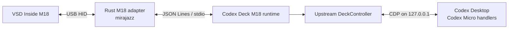

# Codex Deck M18

[English](README.en.md) | **日本語**

VSD Inside M18を、Windows版またはmacOS版Codex Desktopの**Codex Micro操作デバイス**として使うためのOSSプロジェクトです。

導入方式は2つあります。

| 方式 | 状態 | 対応OS | 依存 | ライセンス上の性質 |
|---|---|---|---|---|
| [VSD Craft転用](#導入vsd-craft推奨) | **推奨** | Windows / macOS | VSD Craft必須（プロプライエタリ） | 本リポジトリはOSSだが、実行にはクローズドソース製品を要する |
| [M18直接接続](#導入m18直接接続フルoss構成) | 維持対象のフルOSS構成 | Windows | 追加のプロプライエタリ製品なし | MPL-2.0 + GPL-3.0 + MITで構成するフルOSS経路 |

上流の[Codex Deck](https://github.com/dazer1234/codex-stream-deck)が持つCodex Micro接続・状態取得・描画・イベント送信機能は、どちらの方式でも維持しています。推奨構成では、M18のUSB通信、LCD転送、シーン管理をVSD Craftへ任せます。Linuxは対象外です。

> [!IMPORTANT]
> OpenAI、Codex Deck、M18メーカーによる公式製品ではありません。Codex Desktopの非公開内部インターフェースを利用するため、Codexの更新後に追従修正が必要になる可能性があります。現在の互換性確認対象はCodex Desktop 26.814.5167.0、VSD Craft 3.10.188.226です。live再試験は未完了であり、動作確認済みとは扱いません（[調査記録](docs/vsd-craft/原因調査.md)、[テスト結果](docs/codex-micro-m18/テスト結果V1.md)）。

---

## Codex Deckとは

Codex Deckは、物理デバイスからCodex Desktopの**ネイティブなCodex Micro機能**を操作する上流OSSです。キー入力をショートカットへ変換するだけのマクロツールではありません。Codex DesktopへローカルCDPで接続し、Codex Micro自身が使うイベントと状態を読み書きします。

このM18版は、次のCodex Deck機能を維持しています。

- **6つのAgentキー**：`Codex Settings > Codex Micro`で選択されたソースと割当を使用
- **Agent状態表示**：未割当、待機、作業中、完了未読、承認・入力待ち、エラーを表示
- **選択中タスク表示**：現在開いているCodexタスクと物理キーを同期
- **進捗表現**：Codexに合わせたライト／ダーク表示、状態色、控えめなアニメーション
- **Microアクション**：公開Stream Deck／VSD Craft経路では`ACT06`～`ACT12`の割当とkey-down／key-upをそのまま送信
- **ナビゲーション**：Joystickの上下左右でPlan、Forward、Sidebar、Backを操作
- **Reasoning操作**：エンコーダ押下とReasoning effortの増減
- **公式Keycapコマンド**：インストール中のCodexからコマンド定義を解決して実行
- **利用量表示**：5時間／週次の上限、両期間の概要、リセットクレジット
- **新規タスク**：`codex://threads/new`によるローカルタスク作成
- **複数ホスト**：認証付きSSH／Tailscale relayによるWindows・Mac統合
- **ホスト状態表示**：接続劣化・オフラインとlast-known状態を表示
- **iPhone companion**：SwiftUIアプリからAgent、利用量、Micro操作を利用

### Codex Deck機能とM18 3面の関係

M18の15 LCDキーを3面で使い、必須45操作をすべて収容します。

| Codex Deck機能 | コア実装 | M18 3面 |
|---|---:|---:|
| Agent 1–6とライブ状態 | 維持 | あり |
| Joystick上下左右 | 維持 | あり |
| Encoder押下／Reasoning増減 | 維持 | あり |
| 公式Keycap 30件 | 維持 | VSD Craftでは30件、直接接続では`MIC`枠を`VOICE TALK`へ置換 |
| Usage Limit／Usage Overview | 維持 | あり |
| Rate Limit Reset | 維持 | あり |
| New Task | 維持 | あり（公式`NEW`） |
| Windows／Mac切替キー | 維持 | あり |
| Stream Deckプラグイン | 維持 | M18とは別経路 |
| iPhone companion | 維持 | M18とは別経路 |

## M18版の特徴

- M18の15個のLCDキーでCodex Microの主要操作を実行
- 6つのCodexタスク状態をLCDへ同期表示
- 直接接続構成ではM18専用の`VOICE TALK`からライブ音声会話を開始
- VSD Craft構成では同じ位置の既存`MIC`／Push-to-talk操作を維持
- Plan、Back、Forwardに対応
- M18のファームウェア、Codex Desktop本体、USBドライバーを改変しない
- OpenDeck、Elgato Stream Deckハードウェア、仮想HID、キーボードショートカットは不要
- フルOSS構成では、CodexまたはUSB切断後に再接続する常駐watcherと、キー入力の診断ログを同梱

## 対応機器

| 項目 | 値 |
|---|---|
| 製品 | VSD Inside M18 / HOTSPOTEKUSB HID DEMO |
| Vendor ID | `0x5548` |
| Product ID | `0x1000` |
| LCDキー | 15 |
| 下段ボタン | 3 |

VSD Craft運用時のUSB通信はVSD Craftが行います。上記のUSB IDによる機器判定は、フルOSS構成のM18アダプターが接続先を限定するためのものです。

## キー割当

必須操作45個を、LCD 15キー×3シーンへ重複なく配置します。

| 面 | LCD 15キーの内容 |
|---|---|
| シーン1 | Agent 1～6、Joystick上・下・左・右、Reasoningエンコーダ押下、Windows／Macホスト切替＋health、Usage Limit、Usage Overview、Rate Limit Reset |
| シーン2（VSD Craft） | 公式キー前半：FAST、APPR、REJ、SPLIT、MIC（Push-to-talk）、CODEX、BUG、OAI、TERM、DWN、DEL、NEW、NAV、MAGIC、DIFF |
| シーン2（直接接続） | FAST、APPR、REJ、SPLIT、VOICE TALK、CODEX、BUG、OAI、TERM、DWN、DEL、NEW、NAV、MAGIC、DIFF |
| シーン3 | 公式キー後半：PLAY、GIT、BRCH、MRG、PR、PAINT、LAB、PARTY、TIME、MIND+、MIND-、SETUP、FOLD、UPL、APPS |

### 直接接続構成専用のVOICE TALKキー

直接接続構成のシーン2上段右端にある`VOICE TALK`は、ChatGPT/Codexデスクトップのライブ音声会話を開始するM18専用キーです。通常のDictation／Push-to-talkや、一般のCodex Micro／Stream Deck公開アクションではありません。単押しでCodexのネイティブな`composer.startVoiceMode`コマンドを直接呼ぶため、デック側のショートカット設定は不要です。VSD Craft構成ではこの置換を行わず、同じ位置は既存の`MIC`／Push-to-talkです。

押下時だけ、既存のCodex Micro `active`状態色（紫）へ明るくなって戻る約320ms・4フレームのone-shot表示を行います。常時ループはせず、重複押下を制限し、失敗時は静止表示へ戻ります。M18へ送る静止画とアニメーションフレームは、すべて64×64の不透明PNGへ事前変換されます。

公式キー群には独自の「危険キー」分類を設けていません。`APPR`、`REJ`、`DEL`、`PLAY`を含む各キーは通常の単押しで使用できます。`DEL`は現行実装ではチャットのアーカイブです。`PLAY`は先頭に設定されたEnvironment Actionを呼び出します。`GIT`、`MRG`、`PR`は各フローまたはレビュー画面を開くキーであり、キーを押しただけでcommit、merge、PR公開を確定するものではありません。

公式30キーとは別の`Rate Limit Reset`だけは、利用可能なreset creditを消費するため1.2秒の長押し確認を使用します。

下段左・中央・右は、方式を問わずシーン1・2・3への直接切替に使います。下段ボタンは操作枠に数えないため、必要数は`15 × 3 = 45`です。

---

## 導入：VSD Craft（推奨）

```text
Codex Desktop
    ↕ Codex Micro / CDP
Codex Deckプラグイン
    ↕ VSD公式SDK互換WebSocket
VSD Craft
    ↕ メーカー標準USB制御
VSD Inside M18
```

### 必要環境

- Windows 10以降、またはmacOS
- Codex Desktop
- Node.js 20以降
- VSD Craft（Windows版インストーラ、またはmacOS版アプリ）
- USB接続された対応M18
- Windowsのみ：ESETコマンドラインスキャナ、または後述の`-SkipEsetScan`

RustとC++ツールチェーンは**不要**です。これらが必要なのはフルOSS構成のみです。

VSDinsideがMITで公開しているのは[Plugin SDK](https://github.com/VSDinside/VSDinside-Plugin-SDK)です。VSD Craftアプリ本体は[メーカーEULA](https://store.steampowered.com/eula/4269970_eula_0?l=english)の対象で第三者配布が許可されていないため、本リポジトリには転載せず、未導入時に[公式配布元](https://www.vsdinside.com/pages/download)から利用者の端末へ直接取得します。

### シーン構成

VSD Craftの標準UIでキーをドラッグ配置します。実機には上表の3シーンを設定します。

- 下左：シーン1 — Agent／Navigation／Host／Usage
- 下中央：シーン2 — 公式キー前半15件
- 下右：シーン3 — 公式キー後半15件

下3物理ボタンにはVSD Craft標準の`シーンシフト`だけを設定し、Codex操作は割り当てません。3環境のどの面からでも同じ位置へ直接切り替わります。

### Windowsへの導入

#### 配布版（推奨）

GitHub Releaseの`codex-deck-vsd-craft-windows-v*.zip`を展開し、`Install Codex Deck.cmd`をダブルクリックします。VSD Craftが未導入の場合は、公式VSDinsideサーバーからMSIを直接取得し、Authenticode署名と発行元を検証してからメーカーのインストーラーを開きます。公式アプリ本体を本リポジトリの配布物へ転載はしません。ソース、Node.js、ESET、別途用意するVSD Craftインストーラは不要です。

配布ZIPは既存プラグインを`%LOCALAPPDATA%\CodexDeck\backups`へ退避してから、同梱済みプラグインをVSD Craftへ配置します。署名付きインストーラではないため、Releaseの`SHA256SUMS.txt`でダウンロードを照合してください。

#### ソースからの導入

Windows版インストーラはビルドを行いません。**先にプラグインをビルドしてください。**

```powershell
npm ci
npm run validate:vsd-craft
```

`validate:vsd-craft`は`dist-vsd-craft\com.simeo.codex-deck.sdPlugin`を生成し、manifestを検証します。この成果物が無い状態でインストーラを実行すると失敗します。

続いてインストーラを実行します。

```powershell
.\scripts\Install-VSDCraft-CodexDeck.ps1 `
  -VSDCraftInstallerPath 'C:\path\to\VSD-Craft-Installer_Windows.exe' `
  -Launch
```

スクリプトは実行前に次を検査します。いずれも満たさない場合は処理を中止します。

- `dist-vsd-craft`のプラグインmanifestが期待する互換設定でビルドされていること
- VSD CraftインストーラのAuthenticode署名が有効であること
- ESETコマンドラインスキャナ（`C:\Program Files\ESET\ESET Security\ecls.exe`）が存在し、検査を通過すること

利用可能なスイッチ：

| スイッチ | 用途 |
|---|---|
| `-VSDCraftInstallerPath` | 必須。VSD Craft公式インストーラのパス |
| `-SkipEsetScan` | ESET未導入環境で事前スキャンを省略する |
| `-SkipVSDCraftInstall` | VSD Craft導入済みで、プラグインだけ更新する |
| `-Launch` | 配置後にVSD Craftを起動する |

スクリプトはフルOSS構成のランタイムを停止し、スタートアップ登録を`%LOCALAPPDATA%\CodexDeck\disabled-startup`へ退避します。既存プラグインは`%LOCALAPPDATA%\CodexDeck\backups`へバックアップされます。

### macOSへの導入

#### 配布版（推奨）

GitHub Releaseの`codex-deck-vsd-craft-macos-v*.zip`を展開し、`Install Codex Deck.command`をControlクリックして「開く」を選びます。VSD Craftが未導入の場合は、公式VSDinsideサーバーからPKGを直接取得し、Appleパッケージ署名を検証してからInstallerを開きます。メーカー側の導入完了後、もう一度Codex Deckインストーラーを実行します。公式アプリ本体は転載せず、プラグインとCodex接続ランタイムだけを同梱します。

配布ZIPはmacOSの実行権限を保持しますが、未署名・未公証です。Releaseの`SHA256SUMS.txt`で照合してから実行してください。

#### ソースからの導入

VSD Craft公式macOS版とNode.js 20以上を先に導入してください。スクリプトがビルドから配置まで実行するため、事前ビルドは不要です。

```zsh
chmod +x scripts/install-vsd-craft-codex-deck-macos.sh
./scripts/install-vsd-craft-codex-deck-macos.sh
```

プラグインはVSD Craftの標準保存先`~/Library/Application Support/HotSpot/StreamDock/plugins`へ配置し、既存版を`~/Library/Application Support/CodexDeck/backups`へ退避します。Codex接続には既存のmacOS LaunchAgentをそのまま使用します。詳細は[macOS導入手順](docs/vsd-craft/MACOS.md)を参照してください。

両OSの配布物は次のコマンドで同時生成できます。

```powershell
npm run package:vsd-craft-installers
```

出力先は`outputs/vsd-craft-installers-v<version>`です。

### 会議パネル（Windows専用）

`TEAMS`、`MEET`、`ZOOM`、`Discord`の4シーンを追加できます。各シーンは5列×3行の15キーで、キー位置を4サービス共通にします。

手作業はVSD CraftのUIで空シーンを4つ作るところまでで、名前・ホットキー・アイコンの設定はスクリプトが行います。

```powershell
npm run configure:meeting-panels
```

ホットキーはWindowsショートカットに依存するため、この機能はWindows専用です。キー配置と注意事項は[会議パネル](docs/vsd-craft/MEETING_PANELS.md)を参照してください。

### 設計資料

[ニーズ](docs/vsd-craft/ニーズ.md) / [修正方針](docs/vsd-craft/修正方針.md) / [実行方針](docs/vsd-craft/実行方針.md) / [原因調査](docs/vsd-craft/原因調査.md) / [対応報告](docs/vsd-craft/対応報告.md)

---

## 導入：M18直接接続（フルOSS構成）

追加のプロプライエタリ製品を必要としない、維持対象のフルOSS構成です。VSD Craft運用時には同時起動しません。VSD Craftインストーラは競合防止のため、この構成のランタイムとスタートアップ登録を自動的に無効化します。



Node.jsランタイムは上流Codex Deckの`DeckController`と`CodexMicroRendererBridge`を利用します。RustアダプターはM18の入力受信とLCD画像転送だけを担当します。

RustアダプターはGPL-3.0-only、Node.js側はMITです。両者を同一バイナリへリンクせず、別プロセス間のJSON Lines/stdio通信に限定することで、配布単位とライセンス境界を明確にしています。

### 必要環境

- Windows 10以降
- Codex Desktop
- Node.js 20以降
- Rust stable
- Windows向けRustをビルドできるC++ツールチェーン
- USB接続された対応M18

### ビルド

PowerShellでプロジェクトフォルダを開き、次を実行します。

```powershell
npm ci
npm run check
npm test
npm run build
npm run build:m18
```

完成物は`dist\m18`に生成されます。

### 接続確認

実行前に、M18とCodexブリッジだけを検査できます。

```powershell
Set-Location .\dist\m18
.\Start-CodexDeck-M18.ps1 -DryRun
```

`-DryRun`はファームウェアや設定を変更しません。

### 実行

Codex DesktopとM18を接続した状態で実行します。

```powershell
Set-Location .\dist\m18
.\Start-CodexDeck-M18.ps1
```

Codex Desktopがブリッジなしで既に起動している場合は、Codexを通常終了してから再実行してください。Codexを明示的に再起動させたい場合だけ`-ForceRestart`を使用します。

```powershell
.\Start-CodexDeck-M18.ps1 -ForceRestart
```

### 常駐運用

`dist\m18`を固定したフォルダへ配置し、次のスクリプトをWindowsログオン時に起動するよう登録します。

```powershell
powershell.exe -NoLogo -NoProfile -ExecutionPolicy Bypass -WindowStyle Hidden -File "C:\path\to\CodexDeck\M18\Watch-CodexDeck-M18.ps1"
```

watcherはランタイム終了後に再起動を試み、CodexやM18の再接続に追従します。配置後にフォルダを移動すると起動パスが無効になるため、先に固定配置してください。

### ログ

| ファイル | 内容 |
|---|---|
| watcherスクリプトを置いたフォルダの**親**に生成される`m18.log` | watcher、Codex接続、M18接続、描画同期 |
| `%LOCALAPPDATA%\CodexDeck\m18-events.log` | `key_down` / `key_up`と物理キー番号 |
| `%LOCALAPPDATA%\CodexDeck\codex-micro-bridge.json` | 現在のローカルCDPポート状態 |

`m18.log`だけは出力先が固定パスではありません。上記の常駐運用例のように`C:\path\to\CodexDeck\M18\`へ配置した場合、ログは`C:\path\to\CodexDeck\m18.log`に出力されます。

入力が反応しない場合は、最初に`m18-events.log`へイベントが増えているか確認してください。増えていない場合は[トラブルシューティング](docs/TROUBLESHOOTING.md)を参照してください。

### 設計資料

[Codex Micro版ニーズ](docs/codex-micro-m18/ニーズ.md) / [修正方針](docs/codex-micro-m18/修正方針.md) / [実行方針](docs/codex-micro-m18/実行方針.md) / [実装計画書V1](docs/codex-micro-m18/実装計画書V1.md) / [インシデントレポートV1](docs/codex-micro-m18/インシデントレポートV1.md) / [是正実装計画書V2](docs/codex-micro-m18/実装計画書V2.md) / [実装報告書V1](docs/codex-micro-m18/実装報告書V1.md) / [是正実装報告書V2](docs/codex-micro-m18/実装報告書V2.md) / [M18セットアップ](docs/M18.md)

機能スコープ、実装境界、完了条件の正本は上記の「ニーズ」「修正方針」「実行方針」の3文書です。必須操作は合計45個で、下段3ボタンを面切替として使い、15 LCDキー×3シーンへ全件を収容します。README内の単一面の推奨配置を理由に、Joystick下方向、Reasoningエンコーダ、公式30キー、Usage Overview／Reset、New Task、ホスト切替を対象外または将来対応へ縮小しません。

---

## 開発用コマンド

```powershell
npm run check                     # TypeScript型検査
npm test                          # Nodeテスト一式
npm run build                     # 上流Codex Deckとランチャーをビルド
npm run build:vsd-craft           # VSD Craft向けプラグインをビルド
npm run validate:vsd-craft        # ビルドしてmanifestを検証
npm run configure:meeting-panels  # 会議パネル4シーンを設定（Windows）
npm run build:m18                 # RustアダプターとM18ランタイムをビルド（フルOSS構成）
npm run start:m18                 # ビルド済みM18ランタイムを直接起動（フルOSS構成）
```

## 対応デバイスの購入情報

- [VSDINSIDE M18（Amazon.co.jp）](https://www.amazon.co.jp/dp/B0GT8Q8KGQ)
- 2026年8月16日時点：`￥8,999`、さらに`￥2,001 OFF`クーポン表示あり

価格、クーポン、在庫、適用条件は変更される場合があります。購入画面で最新情報を確認してください。このリンクはAmazonアソシエイトリンクではありません。

## ドキュメント

現行方式の資料は各導入セクションの「設計資料」にまとめています。以下はリポジトリ全体に関わる資料です。

- [アーキテクチャ](docs/ARCHITECTURE.md)
- [トラブルシューティング](docs/TROUBLESHOOTING.md)
- [Windows単独構成](docs/WINDOWS.md)
- [セキュリティ方針](SECURITY.md)
- [README改訂の原因調査](docs/readme/原因調査.md) / [対応報告](docs/readme/対応報告.md)
- [OSS選択・配布物レビューの原因調査](docs/oss-review/原因調査.md) / [対応報告](docs/oss-review/対応報告.md)

リポジトリルートの[初期ニーズ](ニーズ.md)、[初期修正方針](修正方針.md)、[初期実行方針](実行方針.md)は、M18対応着手時点の記録です。現行方式は`docs/vsd-craft/`の資料を参照してください。

## 上流から継承している機能

このリポジトリは上流Codex DeckのStream Deck、マルチホスト、iPhone companion実装も保持しています。ただし、このREADMEの導入手順と実機検証範囲はM18です。

上流のiPhone companionはソース配布のみです。A Mac with Xcode is required to build and install it, even when the phone will control only Windows.（ビルドとインストールにはXcodeを導入したMacが必要で、これは操作対象がWindowsのみの場合も変わりません。）App Store、TestFlight、署名済みIPAでの配布はありません。詳細は[上流由来のiPhone導入手順](docs/IOS_INSTALL.md)を参照してください。

## 謝辞

上流Codex Deckのモバイル構想は、[Shikhar (@xikhar)](https://x.com/xikhar)が公開したコンセプトから着想を得ています。Codex Deck Mobileは上流プロジェクト独自のブリッジ、操作系、ビジュアルを使ったindependent implementation（独立実装）であり、そのコンセプトのソースコードや画像は含みません。

## OSSとライセンス

- 上流Codex DeckとTypeScript側の変更：MIT License
- M18アダプター：GPL-3.0-only（MIT側とは別プロセス＋JSON Lines/stdioで分離）
- mirajazz：MPL-2.0
- M18プロトコル検証情報の参照元：[ibanks42/opendeck-m18](https://github.com/ibanks42/opendeck-m18)（GPL-3.0）

詳細は[THIRD_PARTY_NOTICES.md](THIRD_PARTY_NOTICES.md)、[MIT LICENSE](LICENSE)、[M18 adapter GPL-3.0 LICENSE](m18-adapter/LICENSE)を参照してください。ビルド済みプラグインにも`LICENSE`と、実際にバンドルされたJavaScript依存のライセンス全文を集約した`THIRD_PARTY_NOTICES.md`を同梱します。`dist/m18`にはこれらに加えて、アダプターバイナリ用の`LICENSE.adapter-GPL-3.0`を同梱します。

Codex、OpenAI、Stream Deck、Elgatoおよび各製品名・商標は、それぞれの権利者に帰属します。
