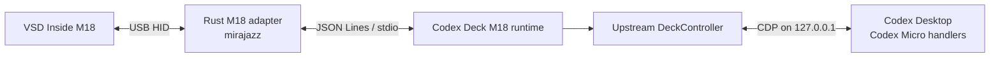

# Codex Deck M18

VSD Inside M18を、Windows版またはmacOS版Codex Desktopの**Codex Micro操作デバイス**として使うためのOSSプロジェクトです。現在の推奨構成はメーカー標準アプリのVSD Craftです。Linuxは対象外です。

上流の[Codex Deck](https://github.com/dazer1234/codex-stream-deck)が持つCodex Micro接続・状態取得・描画・イベント送信機能を維持し、M18のUSB通信、LCD転送、シーン管理はVSD Craftへ任せます。旧mirajazz直接接続方式もロールバック用としてソースに残していますが、VSD Craftと同時には起動しません。

> [!IMPORTANT]
> OpenAI、Codex Deck、M18メーカーによる公式製品ではありません。Codex Desktopの非公開内部インターフェースを利用するため、Codexの更新後に追従修正が必要になる可能性があります。

## 推奨構成：VSD Craft転用

```text
Codex Desktop
    ↕ Codex Micro / CDP
Codex Deckプラグイン
    ↕ VSD公式SDK互換WebSocket
VSD Craft
    ↕ メーカー標準USB制御
VSD Inside M18
```

VSD Craftの標準UIでキーをドラッグ配置します。実機には次の3環境を設定済みです。

- 下左：`Codex Micro` — Agent 1～6、FAST、APPR、REJ、SPLIT、MIC、CODEX、上・左・右
- 下中央：`Codex Tools` — Reasoning、New Task、使用量、DIFF、Browser、Settingsなど
- 下右：`デフォルトシーン` — M18メーカー標準面

下3物理ボタンにはVSD Craft標準の`シーンシフト`だけを設定し、Codex操作は割り当てません。3環境のどの面からでも同じ位置へ直接切り替わります。

ビルドと検証：

```powershell
npm run validate:vsd-craft
```

Windowsへの導入：

```powershell
.\scripts\Install-VSDCraft-CodexDeck.ps1 `
  -VSDCraftInstallerPath 'C:\path\to\VSD-Craft-Installer_Windows.exe' `
  -Launch
```

macOSへの導入（VSD Craft公式macOS版とNode.js 20以上を先に導入）：

```zsh
chmod +x scripts/install-vsd-craft-codex-deck-macos.sh
./scripts/install-vsd-craft-codex-deck-macos.sh
```

macOS版はVSD Craftの標準保存先`~/Library/Application Support/HotSpot/StreamDock/plugins`へプラグインを配置し、既存版を`~/Library/Application Support/CodexDeck/backups`へ退避します。Codex接続には既存のmacOS LaunchAgentをそのまま使用します。詳細は[macOS導入手順](docs/vsd-craft/MACOS.md)を参照してください。

詳細は[ニーズ](docs/vsd-craft/ニーズ.md)、[修正方針](docs/vsd-craft/修正方針.md)、[実行方針](docs/vsd-craft/実行方針.md)を参照してください。

## 旧方式：M18直接接続

以下はロールバック用のmirajazz直接接続方式です。VSD Craft運用時には起動しません。

## Codex Deckとは

Codex Deckは、物理デバイスからCodex Desktopの**ネイティブなCodex Micro機能**を操作する上流OSSです。キー入力をショートカットへ変換するだけのマクロツールではありません。Codex DesktopへローカルCDPで接続し、Codex Micro自身が使うイベントと状態を読み書きします。

このM18版は、次のCodex Deck機能を維持しています。

- **6つのAgentキー**：`Codex Settings > Codex Micro`で選択されたソースと割当を使用
- **Agent状態表示**：未割当、待機、作業中、完了未読、承認・入力待ち、エラーを表示
- **選択中タスク表示**：現在開いているCodexタスクと物理キーを同期
- **進捗表現**：Codexに合わせたライト／ダーク表示、状態色、控えめなアニメーション
- **Microアクション**：`ACT06`～`ACT12`の割当とkey-down／key-upをそのまま送信
- **ナビゲーション**：Joystickの上下左右でPlan、Forward、Sidebar、Backを操作
- **Reasoning操作**：エンコーダ押下とReasoning effortの増減
- **公式Keycapコマンド**：インストール中のCodexからコマンド定義を解決して実行
- **利用量表示**：5時間／週次の上限、両期間の概要、リセットクレジット
- **新規タスク**：`codex://threads/new`によるローカルタスク作成
- **複数ホスト**：認証付きSSH／Tailscale relayによるWindows・Mac統合
- **ホスト状態表示**：接続劣化・オフラインとlast-known状態を表示
- **iPhone companion**：SwiftUIアプリからAgent、利用量、Micro操作を利用

### Codex Deck機能とM18既定面の関係

Codex Deckの機能はコードから削除していません。ただしM18の18ボタンには全追加機能を同時配置できないため、既定面はCodex Micro本体の操作を優先しています。

| Codex Deck機能 | コア実装 | M18既定ボタン |
|---|---:|---:|
| Agent 1–6とライブ状態 | 維持 | あり |
| `ACT06`～`ACT12` | 維持 | あり |
| Joystick上下左右 | 維持 | 上・左・右のみ |
| Encoder押下／Reasoning増減 | 維持 | なし |
| Codex環境アクション1～3 | 維持 | 下段3ボタン |
| 公式Keycap単独コマンド | 維持 | なし |
| Usage Limit／Usage Overview | 維持 | なし |
| Rate Limit Reset | 維持 | なし |
| New Task | 維持 | なし |
| Windows／Mac切替キー | 維持 | なし |
| Stream Deckプラグイン | 維持 | M18とは別経路 |
| iPhone companion | 維持 | M18とは別経路 |

ここで「なし」は機能削除ではなく、現在のM18固定レイアウトに物理キーを割り当てていないという意味です。

## M18版の特徴

- M18の15個のLCDキーでCodex Microの主要操作を実行
- 下段3ボタンはCodex Microと同じネイティブコマンド`environmentAction1`～`environmentAction3`を実行
- 6つのCodexタスク状態をLCDへ同期表示
- Codex Micro固有のFast、Approve、Reject、Fork、Dictation、Sendをそのまま送信
- Plan、Back、Forwardに対応
- CodexまたはUSB切断後に再接続する常駐watcherを同梱
- キー入力を診断ログへ記録
- M18のファームウェア、Codex Desktop本体、USBドライバーを改変しない
- OpenDeck、Elgato Stream Deck、仮想HID、キーボードショートカットは不要

## 対応機器

現在のM18アダプターは、次のUSB IDを持つ実機だけを受け付けます。

| 項目 | 値 |
|---|---|
| 製品 | VSD Inside M18 / HOTSPOTEKUSB HID DEMO |
| Vendor ID | `0x5548` |
| Product ID | `0x1000` |
| LCDキー | 15 |
| 下段ボタン | 3 |

## キー割当

| M18入力 | Codex Micro機能 |
|---|---|
| LCD 1–6 | Agent 1–6 |
| LCD 7 | `ACT06`（既定：Fast） |
| LCD 8 | `ACT07`（既定：Approve） |
| LCD 9 | `ACT08`（既定：Reject） |
| LCD 10 | `ACT09`（既定：Fork） |
| LCD 11 | `ACT10/11`（既定：Dictation） |
| LCD 12 | `ACT12`（既定：Send） |
| LCD 13 | Plan（Joystick Up） |
| LCD 14 | Back（Joystick Left） |
| LCD 15 | Forward（Joystick Right） |
| 下段左 | Codex環境アクション1（`environmentAction1`） |
| 下段中央 | Codex環境アクション2（`environmentAction2`） |
| 下段右 | Codex環境アクション3（`environmentAction3`） |

下段3ボタンはM18内のページやプロファイルを切り替えません。Codex Desktopが登録している環境アクションのコマンドIDを、Codex Microと同じコマンドランナーへ渡します。各スロットが何をするかはCodex側の設定に従います。

LCD 7～12は名称をハードコードしたマクロではなく、Codex Microのアクションスロットです。Codex側で割当を変更すると、Codex Deckが取得する表示と実行内容も追従します。表中の名称はCodex Microの既定構成を示します。

## 仕組み



Node.jsランタイムは上流Codex Deckの`DeckController`と`CodexMicroRendererBridge`を利用します。RustアダプターはM18の入力受信とLCD画像転送だけを担当します。

## 必要環境

- Windows 10以降
- Codex Desktop
- Node.js 20以降
- Rust stable
- Windows向けRustをビルドできるC++ツールチェーン
- USB接続された対応M18

## ビルド

PowerShellでプロジェクトフォルダを開き、次を実行します。

```powershell
npm ci
npm run check
npm test
npm run build
npm run build:m18
```

完成物は`dist\m18`に生成されます。

## 接続確認

実行前に、M18とCodexブリッジだけを検査できます。

```powershell
Set-Location .\dist\m18
.\Start-CodexDeck-M18.ps1 -DryRun
```

`-DryRun`はファームウェアや設定を変更しません。

## 実行

Codex DesktopとM18を接続した状態で実行します。

```powershell
Set-Location .\dist\m18
.\Start-CodexDeck-M18.ps1
```

Codex Desktopがブリッジなしで既に起動している場合は、Codexを通常終了してから再実行してください。明示的にCodexを再起動させる場合だけ`-ForceRestart`を使用します。

```powershell
.\Start-CodexDeck-M18.ps1 -ForceRestart
```

## 常駐運用

`dist\m18`を固定したフォルダへ配置し、次のスクリプトをWindowsログオン時に起動するよう登録します。

```powershell
powershell.exe -NoLogo -NoProfile -ExecutionPolicy Bypass -WindowStyle Hidden -File "C:\path\to\CodexDeck\M18\Watch-CodexDeck-M18.ps1"
```

watcherはランタイム終了後に再起動を試み、CodexやM18の再接続に追従します。配置後にフォルダを移動すると起動パスが無効になるため、先に固定配置してください。

## ログ

| ファイル | 内容 |
|---|---|
| `%LOCALAPPDATA%\CodexDeck\m18.log` | watcher、Codex接続、M18接続、描画同期 |
| `%LOCALAPPDATA%\CodexDeck\m18-events.log` | `key_down` / `key_up`と物理キー番号 |
| `%LOCALAPPDATA%\CodexDeck\codex-micro-bridge.json` | 現在のローカルCDPポート状態 |

入力が反応しない場合は、最初に`m18-events.log`へイベントが増えているか確認してください。

## 開発用コマンド

```powershell
npm run check       # TypeScript型検査
npm test            # Nodeテスト一式
npm run build       # 上流Codex Deckとランチャーをビルド
npm run build:m18   # RustアダプターとM18ランタイムをビルド
npm run start:m18   # ビルド済みM18ランタイムを直接起動
```

## 設計資料

- [M18セットアップ](docs/M18.md)
- [Codex Micro版ニーズ](docs/codex-micro-m18/ニーズ.md)
- [Codex Micro版修正方針](docs/codex-micro-m18/修正方針.md)
- [Codex Micro版実行方針](docs/codex-micro-m18/実行方針.md)
- [初期ニーズ](ニーズ.md)
- [初期修正方針](修正方針.md)
- [初期実行方針](実行方針.md)
- [セキュリティ方針](SECURITY.md)

## 上流から継承している機能

このリポジトリは上流Codex DeckのStream Deck、マルチホスト、iPhone companion実装も保持しています。ただし、このREADMEの導入手順と実機検証範囲はWindows＋M18です。

上流のiPhone companionはソース配布のみです。A Mac with Xcode is required to build and install it, even when the phone will control only Windows. App Store、TestFlight、署名済みIPAでの配布はありません。詳細は[上流由来のiPhone導入手順](docs/IOS_INSTALL.md)を参照してください。

## 謝辞

上流Codex Deckのモバイル構想は、[Shikhar (@xikhar)](https://x.com/xikhar)が公開したコンセプトから着想を得ています。Codex Deck Mobileは上流プロジェクト独自のブリッジ、操作系、ビジュアルを使ったindependent implementationであり、そのコンセプトのソースコードや画像は含みません。

## OSSとライセンス

- 上流Codex DeckとTypeScript側の変更：MIT License
- M18アダプター：GPL-3.0-only
- mirajazz：MPL-2.0
- M18プロトコル検証情報の参照元：[ibanks42/opendeck-m18](https://github.com/ibanks42/opendeck-m18)（GPL-3.0）

詳細は[THIRD_PARTY_NOTICES.md](THIRD_PARTY_NOTICES.md)、[MIT LICENSE](LICENSE)、[M18 adapter GPL-3.0 LICENSE](m18-adapter/LICENSE)を参照してください。

Codex、OpenAI、Stream Deck、Elgatoおよび各製品名・商標は、それぞれの権利者に帰属します。
